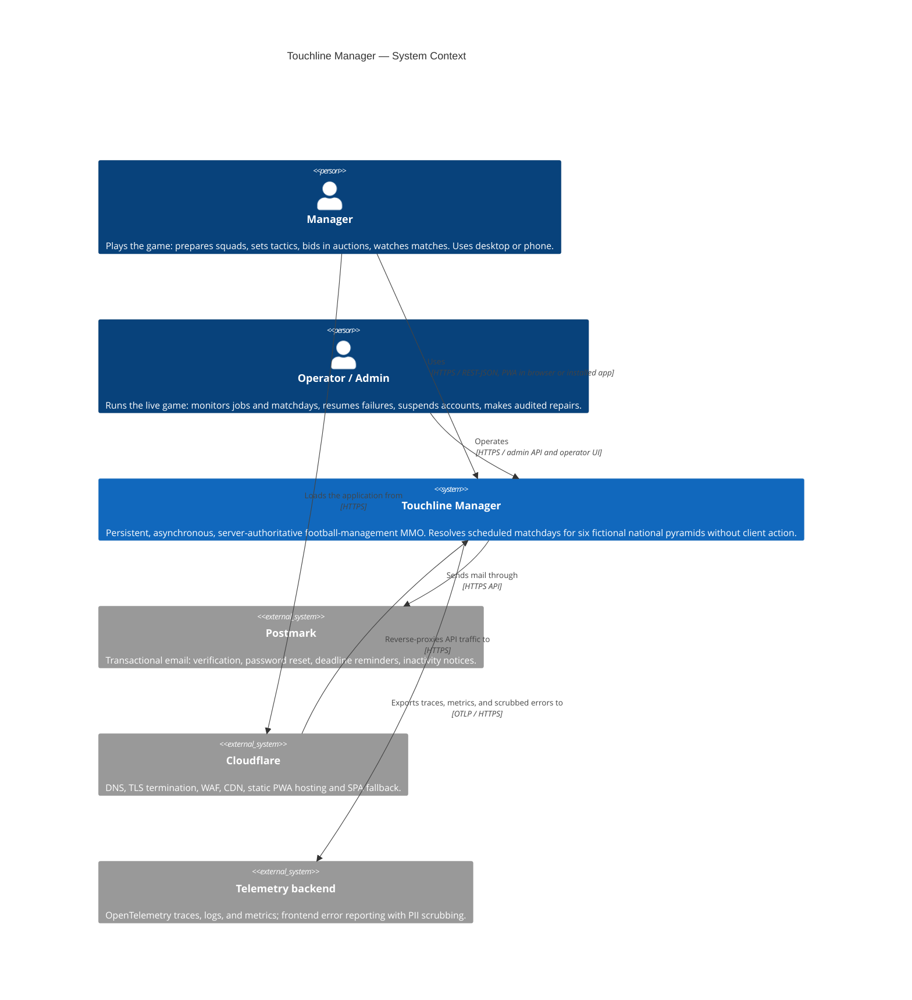
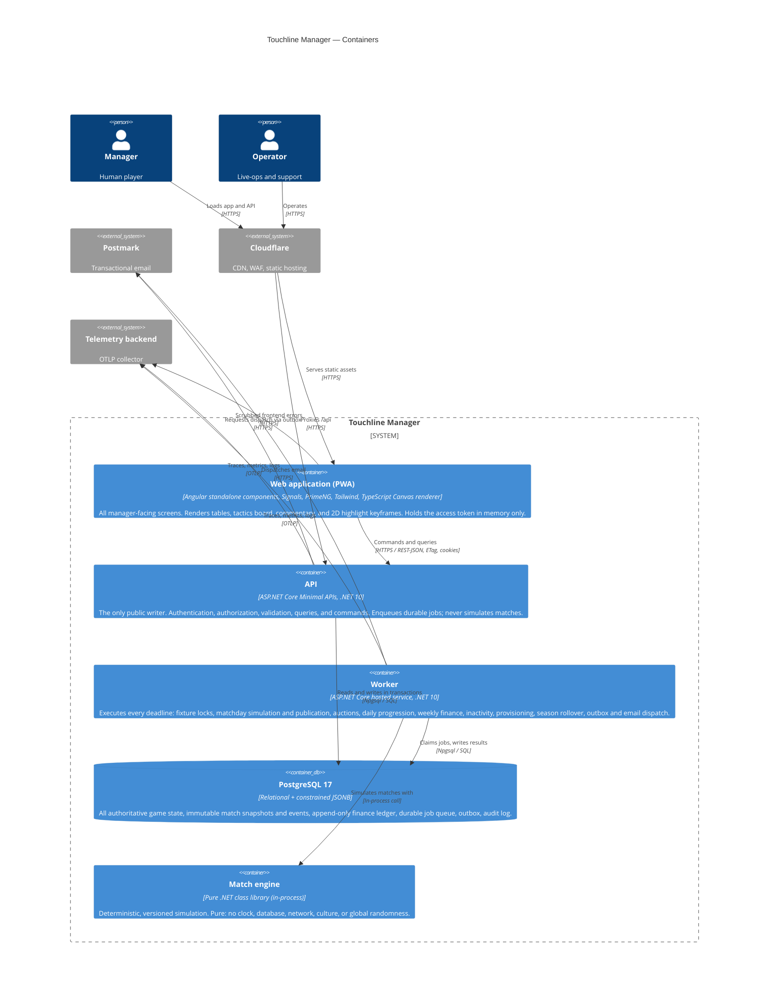

# System Context and Containers (C4)

> **Level 1 and 2** of the C4 model. Level 3 (components) lives in [`modules.md`](modules.md);
> the data model lives in [`data-model.md`](data-model.md).

---

## 1. System context

Who uses the system, and what it depends on.



**What is deliberately absent at MVP.** No social login provider, no payment provider, no
push notification service, no third-party game-data feed, no analytics vendor on the critical
path, and no club/player licensing feed — all identity is generated fiction.

---

## 2. Containers



---

## 3. Deployment mapping

| Container | Hosted as | Scaling |
|---|---|---|
| Web PWA | Cloudflare Pages, immutable hashed assets, SPA fallback | CDN |
| API | Render paid web service, always on | Horizontal behind the provider LB; stateless, holds no deadlines |
| Worker | Render background worker, always on | Horizontal; correctness comes from job leases, not from being single-instance |
| PostgreSQL 17 | Render managed PostgreSQL, same region, automated backups + PITR | Vertical, plus indexes and projections before any sharding |
| Match engine | In-process library inside API and Worker deployments | Single-threaded per match; parallelism across fixtures |

See [ADR-0008](../architecture/adr/0008-deployment-topology.md) for why the worker is never
scaled to zero and never folded into the API process.

---

## 4. Trust boundaries

| # | Boundary | Crossing rule |
|---|---|---|
| TB-1 | Browser ↔ Edge | Untrusted. TLS, HSTS, exact CORS allowlist, WAF, rate limits. Nothing from the client is authoritative except explicit manager intent. |
| TB-2 | Edge ↔ API | TLS. The API re-asserts security headers and origin checks rather than trusting the edge alone. |
| TB-3 | API ↔ Database | Trusted, least privilege. Separate migration and runtime roles. Parameterized queries only. |
| TB-4 | Worker ↔ Database | Trusted, least privilege. Sole writer of match, publication, provisioning, rollover, and finance-run state. |
| TB-5 | API/Worker ↔ Email provider | Secrets from environment/provider secret storage. Outbound dispatch only, through the outbox. |
| TB-6 | Operator ↔ Admin API | Highest trust. MFA-authenticated, reason-required, idempotency-keyed, always audited. |
| TB-7 | Engine ↔ everything | The engine has no boundary at all: it is pure and cannot reach outside its own inputs. This is enforced by architecture tests. |

---

## 5. Principal data flows

### 5.1 Manager preparation (any time before lock)

```text
Manager → PWA → API → PostgreSQL
                      └─ ops.jobs (fixture lock scheduled for kickoff − 30 min)
```

The manager's writes are ordinary optimistic-concurrency updates. Nothing about them is
deadline-critical until a lock exists.

### 5.2 Fixture lock (kickoff − 30 min)

```text
Worker claims LockFixtureTeamSheets job
  → application use case validates and deterministically repairs both clubs' selections
  → canonical input snapshot frozen + hashed, RNG seed derived by HMAC
  → match.input_snapshots written, fixture marked locked (optimistic version check)
  → inbox repair notices and outbox events committed in the same transaction
```

### 5.3 Matchday resolution and publication (kickoff)

```text
Worker claims ResolveDivisionMatchday job (division-matchday business lock)
  → 9 independent simulation attempts, each single-threaded, each writing `staged`
  → ResolveDivisionMatchday verifies all 9 staged, then PublishDivisionMatchday
     validates and, in ONE transaction:
        fixtures/matches → published
        standings, player stats, discipline, injuries, fatigue, morale applied
        gate revenue posted to the ledger
        outbox messages written
  → never publishes 5 of 9 results
```

### 5.4 Auction resolution (fixed window, never within 6 h before kickoff)

```text
Worker claims ResolveTransferAuction job
  → serializable transaction: revalidate account status, reservation, squad limits,
    seller minimum, contracts, listing status
  → winner pays, seller credited, registration moves, old contract closes, new contract opens
  → loser reservations released; outcomes audited; outbox notification
```

### 5.5 Season rollover (after matchday 34, seven days)

```text
Preflight → freeze writes → finalize standings → promotion/relegation
→ awards and finance summaries → contract expiry and renewals → game-year increment and aging
→ move clubs into next season entries → generate schedules and tie-draw keys
→ reset discipline → reopen writes → news/inbox → complete
```

Each step stores a checkpoint. A failure in one country never corrupts another, and the new
world season activates only when every country has finished.

### 5.6 Onboarding and pyramid growth

```text
Manager claims club
  → serializable transaction: lock manager, club, country capacity, tenure rows
  → insert tenure, update last-active metadata
  → enqueue capacity evaluation + welcome inbox in the same transaction
  → if the lowest active tier is now 18/18 human: create provisioning request, enqueue
    ProvisionDivision job (country advisory lock, unique (country, target_tier))
  → ProvisionDivision generates 18 AI clubs, squads, finances, fixtures, and backfills
    already-passed matchdays as bootstrap results, then activates the tier for claims
```

---

## 6. Why the topology is shaped this way

| Requirement | Topology answer |
|---|---|
| Never publish five of nine results | One database, one transaction, publication in the worker |
| Deadlines must survive deploys and crashes | Durable job rows; always-on worker; no in-memory timers |
| Results must be re-derivable | Immutable snapshots + versioned pure engine + stored hashes |
| Clients must not influence outcomes | Engine runs only in the worker; there is no simulate endpoint |
| Unlimited managers per country | Asynchronous provisioning job with deterministic backfill |
| Two clients (web + future native) | One API, cookies for the browser, versioned auth adapter for native |
| Small operating team | Three runtime pieces, one migration stream, one backup story |
