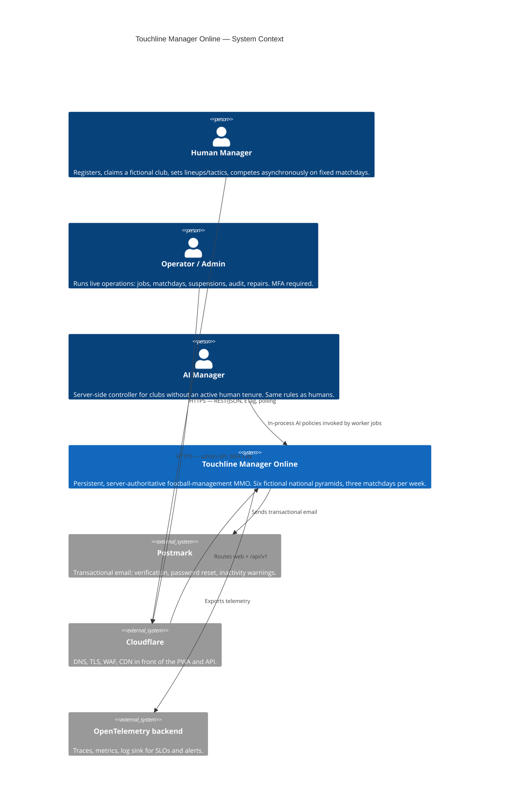

# Architecture — Context and Containers

C4 model, level 1 (context) and level 2 (containers). Diagrams render with Mermaid. Module-level boundaries: [modules.md](modules.md). First ER diagram: [data-model.md](data-model.md).

## C4 Level 1 — System context



## C4 Level 2 — Container diagram

```mermaid
C4Container
    title Touchline Manager Online — Containers
    Person(manager, "Human Manager", "")
    Person(admin, "Operator / Admin", "MFA role")
    System_Ext(emailProvider, "Postmark", "Transactional email")
    System_Ext(otel, "OpenTelemetry backend", "Telemetry")

    System_Boundary(tmo, "Touchline Manager Online")
        Container(web, "Angular PWA", "Angular standalone + Signals, PrimeNG, Tailwind, service worker", "Responsive installable client. Access token in memory; refresh cookie bootstraps session. Polls /sync. No offline mutations.")
        Container(api, "ASP.NET Core API", ".NET 10 Minimal API", "The only public writer. Auth, validation, ETag/If-Match, rate limits, OpenAPI. Contains no game formulas.")
        Container(worker, ".NET Worker", ".NET 10 background service", "Durable jobs: fixture locks, matchdays, auctions, daily progression, finances, inactivity, provisioning, season rollover. Invokes the same application use cases.")
        ContainerDb(pg, "PostgreSQL 17", "Single database, schema-per-module", "auth, world, squad, competition, match, market, finance, comms, ops. Transactions, job queue, outbox, audit.")
        Container(matchEngine, "MatchEngine library", "Pure deterministic C#", "PCG32, unit ratings, possession/chance/discipline/injury, events, commentary tokens, highlight keyframes. No clock, DB, network, or global randomness.")
    End
End

    Rel(manager, web, "HTTPS")
    Rel(admin, web, "/admin (role-protected)")
    Rel(web, api, "HTTPS REST/JSON, ETag, polling")
    Rel(api, pg, "EF Core transactions")
    Rel(api, pg, "Enqueues jobs + outbox in-transaction")
    Rel(worker, pg, "FOR UPDATE SKIP LOCKED leases")
    Rel(worker, matchEngine, "Simulates from immutable snapshots")
    Rel(api, matchEngine, "Read-only preview/validation helpers")
    Rel(worker, emailProvider, "DispatchEmail job")
    Rel(api, otel, "Traces/metrics")
    Rel(worker, otel, "Job + simulation spans")
```

## Trust boundaries and authority rules

| Boundary | Crossing | Rule |
|---|---|---|
| Internet → CDN/WAF | Public HTTPS only | HSTS, exact CORS allowlist, restrictive CSP, `frame-ancestors`, request-size caps |
| CDN → API | `/api/v1`, RFC 9457 Problem Details + stable `code` + correlation ID | Rate limits by route, IP prefix, user, account status |
| Browser → API | Access token (memory) + refresh cookie | Cookie mutations CSRF/origin-checked; refresh rotation with reuse detection |
| API → PostgreSQL | EF parameterization only | No string-built SQL from request data; migration vs runtime roles |
| Worker → PostgreSQL | Job leases, advisory locks only for singleton country/season workflows | Deadlines come from the durable table, never in-memory timers |
| Worker → MatchEngine | Frozen snapshot in, hashed output out | **Match simulation is never a public endpoint** (no `POST /match/simulate`) |
| Any → Email provider | Only via `DispatchEmail` outbox job | Raw email tokens never logged or stored |

Non-negotiable authority invariants (plan §1.1, §12.3):

1. Clients submit decisions, never outcomes or ratings.
2. Deadlines use server time; UTC is authoritative, UI converts to local.
3. Snapshot + simulation run only on the worker.
4. Money, claims, bids, and renewals are database transactions — never optimistic client updates.
5. Completed match inputs/outputs are hashed and immutable.
