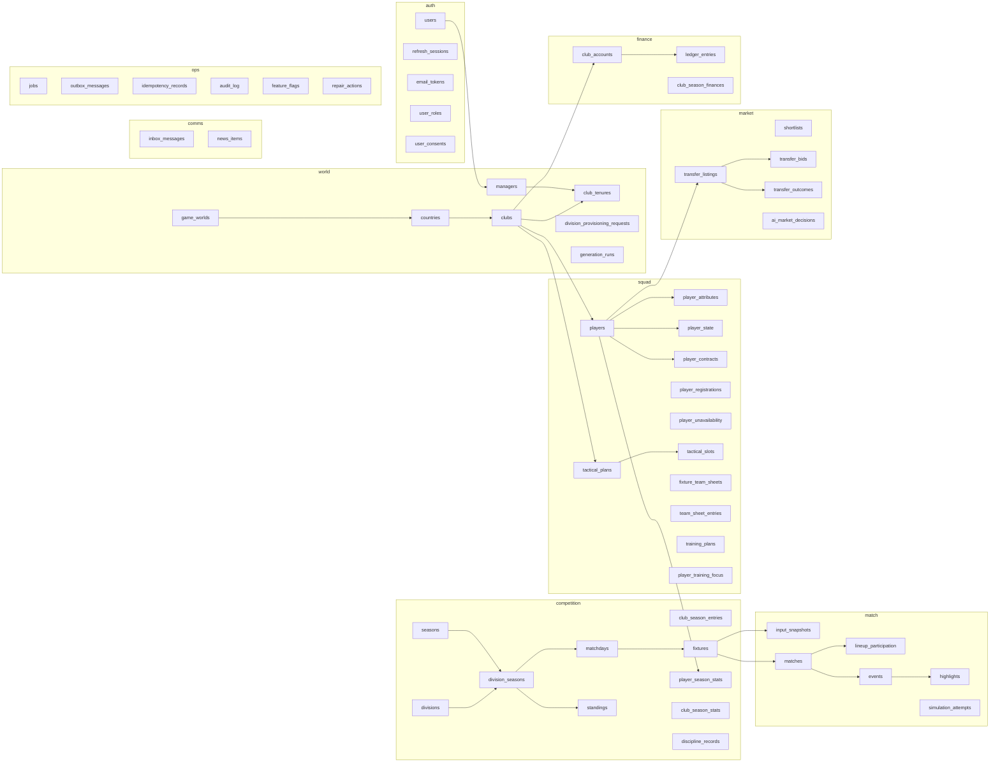
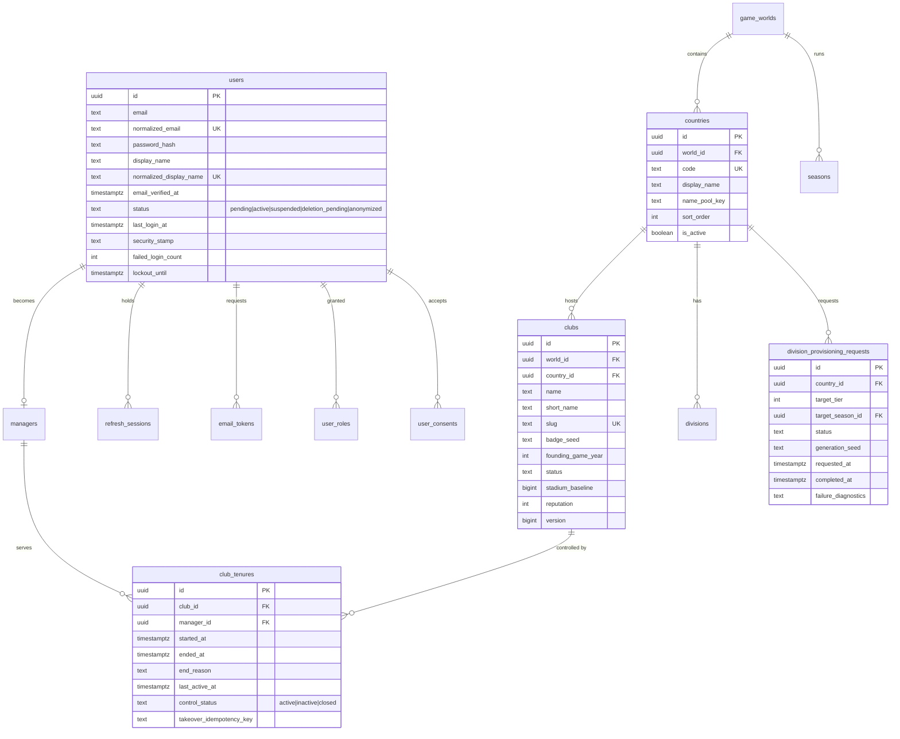
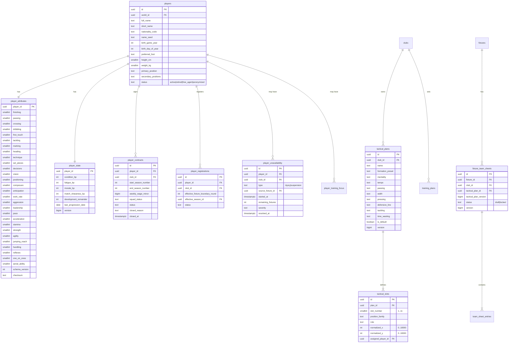
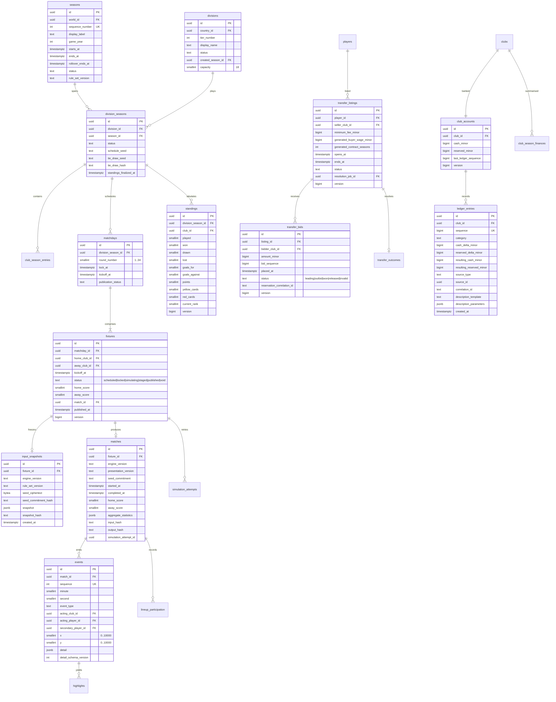
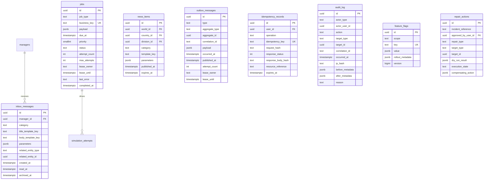

# Data Model

> **Scope:** the logical model and the constraints that carry correctness. Exact EF Core
> mappings and generated SQL belong in migrations (Stage 2 onward); master plan §6 is the
> normative column-level reference and this document explains structure, keys, and policy.

---

## 1. Common conventions

| Convention | Rule |
|---|---|
| Primary keys | `id uuid primary key`, server-generated UUIDv7 (`ID-1`) |
| Tenancy | `world_id uuid` on every table where a world can be derived, so future shards/test worlds need no schema rewrite |
| Timestamps | `created_at`, `updated_at` as UTC `timestamptz not null` |
| Concurrency | `version bigint not null default 1` on mutable aggregates; exposed as a strong ETag |
| Names | `snake_case` in PostgreSQL, `PascalCase` in C# (`ID-2`) |
| Money | `bigint` minor units, single display currency. Never `float`/`double`/`numeric` money arithmetic in application code (`FIN-1`, `FIN-2`) |
| Deletes | Completed seasons, fixtures, financial records, bids, match snapshots, and audit rows are never deleted. Status fields and anonymization replace destructive deletes. |

**Referential integrity.** Restrictive foreign keys for history. `ON DELETE CASCADE` is not
used for business history. When there is genuinely no safe parent to delete, the operation is
a status change, not a delete.

---

## 2. Schema overview

---

## 3. Entity relationships

### 3.1 Identity and world

**Critical indexes and constraints**

| Constraint | Table | Why |
|---|---|---|
| `unique (normalized_email)` | `users` | Account identity |
| `unique (normalized_display_name)` | `users` | Public identity uniqueness |
| `check (status in ...)`, `check (failed_login_count >= 0)` | `users` | The lifecycle cannot leave the states the code knows |
| `unique (token_hash)` | `refresh_sessions`, `email_tokens` | Tokens are looked up by hash; a duplicate could only mean a reused secret |
| `unique (user_id, role)` (primary key) | `user_roles` | A role is granted to an account once |
| `check (revoked_at is null) = (revocation_reason is null)` | `refresh_sessions` | A revoked session always says why |
| Restrictive FKs to `users` | `user_roles`, `refresh_sessions`, `email_tokens`, `user_consents` | Session and consent history cannot outlive its account; account deletion is a status change, never a delete (ADR-0002) |
| `unique (world_id, code)` | `countries` | Stable country identity |
| `unique (world_id, normalized_name)`, `unique (world_id, slug)` | `clubs` | No duplicate fictional clubs |
| **Partial unique** one `active`/`inactive` tenure per club | `club_tenures` | A club cannot have two managers |
| **Partial unique** one `active`/`inactive` tenure per manager | `club_tenures` | One club per manager (`OCC-9`) |
| `unique (country_id, target_tier)` | `division_provisioning_requests` | No duplicate tower creation (`PYR-3`) |
| Status check + transition check | `users` | Prevents illegal lifecycle jumps |

### 3.2 Squad, contracts, and tactics

**Critical indexes and constraints**

| Constraint | Table | Why |
|---|---|---|
| `check (attribute between 1 and 20)` on every attribute column | `player_attributes` | `TRN-4`; the engine assumes this range |
| `check` on basis-point ranges | `player_state` | `TRN-5..7` |
| **Partial unique** one `active` contract per player | `player_contracts` | `SQ-6` |
| **Partial unique** one `active` registration per player | `player_registrations` | `SQ-6` |
| `unique (division_season_id, player_id, club_id)` | `player_season_stats` | One stat line per player per club per season |
| **Partial unique** one `is_default` plan per club | `tactical_plans` | `INS-11` |
| `unique (plan_id, slot_number)`, `unique (plan_id, assigned_player_id)` | `tactical_slots` | No duplicate shirt slots or players |
| `check (normalized_x between 0 and 10000)` etc. | `tactical_slots` | `TAC-9` |
| `unique (fixture_id, club_id)` | `fixture_team_sheets` | One sheet per club per fixture |
| **Partial unique** one active scheduling record per club | `training_plans` | Latest plan wins |
| Trigram/full-text index on player name | `players` | Scouting search |
| `unique (manager_id, player_id)` | `market.shortlists` | `SCT-3` (see §7 on the plan's internal conflict about this table's schema) |

> Contract/registration agreement (`SQ-6`) is enforced in the application transaction and by
> invariant integration tests, because a partial unique index alone cannot express "these two
> rows must agree on club and status".

### 3.3 Competition, matches, market, finance

**Critical indexes and constraints**

| Constraint | Table | Why |
|---|---|---|
| `unique (world_id, sequence_number)` | `seasons` | One season number per world |
| `unique (country_id, tier_number)`, `check (tier_number >= 1)` | `divisions` | `WORLD-4`, no tier 0 |
| `unique (division_id, season_id)` | `division_seasons` | One instance per division per season |
| `unique (division_season_id, club_id)` | `club_season_entries`, `standings` | One entry and one standing per club |
| `unique (division_season_id, round_number)` | `matchdays` | 34 rounds |
| `check (home_club_id <> away_club_id)` | `fixtures` | A club cannot play itself |
| `check (home_score >= 0 and away_score >= 0)` | `fixtures` | Nonnegative scores |
| Score required only when `status in (staged, published)` | `fixtures` | No half-resolved fixtures |
| Unique home/away pair per leg + one fixture per club per matchday | `fixtures` | Backed by generation validation plus database support where practical |
| Index `(club_id, kickoff_at, status)`, `(matchday_id, status)` | `fixtures` | Fixture lists, dashboard, matchday resolution |
| `unique (fixture_id)` | `input_snapshots`, `matches` | One snapshot, one match |
| `unique (match_id, sequence)` | `events` | Ordered event stream; `MAT-9` |
| Index `(match_id, minute)`, `(player_id, event_type)` | `events` | Commentary and stats |
| `unique (source_event_id)` where one highlight per event | `highlights` | Determinism |
| `check (minimum_fee_minor > 0)`, `check (ends_at > opens_at + minimum exposure)` | `transfer_listings` | `TRF-1`, `TRF-2` |
| **Partial unique** one active listing per player | `transfer_listings` | `TRF-14` |
| **Partial unique** one active bid per listing per club | `transfer_bids` | `TRF-6` |
| Index `(listing_id, status, amount_minor, bid_sequence)` | `transfer_bids` | `TRF-8` ordering |
| `unique (listing_id)` | `transfer_outcomes` | Resolution happens once |
| `check (cash_minor >= 0 and reserved_minor >= 0)` | `club_accounts` | `FIN-13` |
| `unique (club_id, sequence)`, unique `(correlation_id, category)` where idempotency requires | `ledger_entries` | `FIN-11`, `FIN-17` |

### 3.4 Communications and operations

**Critical indexes and constraints**

| Constraint | Table | Why |
|---|---|---|
| `unique (job_type, business_key)` | `jobs` | Enqueue idempotency (`ADR-0003`) |
| Index `(status, due_at, priority)` | `jobs` | Ready-job claim path |
| Index `(status, due_at)` on unpublished outbox | `outbox_messages` | Dispatch path |
| `unique (user_id, operation, idempotency_key)` | `idempotency_records` | Reject key reuse with a different request hash |
| Index unread messages by manager | `inbox_messages` | Inbox and unread counter |
| Append-only, restricted access | `audit_log` | Tamper evidence |

---

## 4. JSONB policy

Relational columns are used for identities, relationships, money, state, attributes used in
filters, tactics used in validation, table data, and anything used for concurrency. JSONB is
permitted **only** for:

| Allowed use | Table.column | Versioned by |
|---|---|---|
| Immutable match input snapshot | `match.input_snapshots.snapshot` | `engine_version` + `snapshot_hash` |
| Engine configuration snapshot/hash | `match.input_snapshots.snapshot` | `rule_set_version` |
| Typed match-event detail | `match.events.detail` | `detail_schema_version` |
| Semantic highlight keyframes | `match.highlights.keyframe_payload` | `presentation_version` |
| Notification/news template parameters | `comms.inbox_messages.parameters`, `comms.news_items.parameters` | template key |
| Audit before/after metadata where relational querying is not needed | `ops.audit_log.before_metadata`, `.after_metadata` | — |
| Job payloads | `ops.jobs.payload` | `job_type` |
| Aggregate match statistics | `match.matches.aggregate_statistics` | `engine_version` |

Binding rules:

| Rule | Statement |
|---|---|
| JSN-1 | Every JSONB document includes a schema or version discriminator. |
| JSN-2 | Every document type has application-level validation on write. |
| JSN-3 | Every document type has a golden deserialization test, including a rejected malformed case. |
| JSN-4 | None of the above may be promoted into a hot filter path; if a field must be filtered or sorted, it becomes a relational column. |
| JSN-5 | JSONB is never used as a shortcut for unfinished modelling. |

---

## 5. Projections and reconciliation

| Projection | Source of truth | Rebuild path |
|---|---|---|
| `competition.standings` | Published fixtures | `RebuildProjection` job, then assert equality with the live projection (`TBL-13`) |
| `competition.player_season_stats` | Published match events and lineups | Same job |
| `competition.discipline_records` | Published cards and suspension service | Same job |
| `finance.club_accounts.cash_minor` / `reserved_minor` | Append-only `finance.ledger_entries` | Ledger replay must reproduce both balances exactly (`FIN-18`) |
| `squad.player_state` | Published match participation plus daily progression | Replay of progression inputs for a bounded window |

A projection is treated as a cache of a derivable fact. Any repair that cannot be expressed
as a rebuild is an audited `ops.repair_actions` entry with a compensating action.

---

## 6. Migration policy

| Rule | Statement |
|---|---|
| MIG-1 | EF Core migrations live in Infrastructure and are reviewed as SQL in CI. |
| MIG-2 | Every migration documents forward validation and rollback/compensation notes. |
| MIG-3 | Breaking changes use expand → migrate → contract. No deployment requires a destructive same-step migration. |
| MIG-4 | Migrations seed only stable reference and rule data. World generation is an explicit idempotent application tool/job, never a migration. |
| MIG-5 | Production migrations run as a controlled pre-deploy job using the migration database role, never at application startup. |
| MIG-6 | A verified backup is taken before high-risk migrations and before season-engine data changes. |
| MIG-7 | Partial unique indexes, check constraints, and exclusion constraints are covered by integration tests against real PostgreSQL — never an in-memory provider. |

---

## 7. Resolved conflict in the master plan: `shortlists`

The master plan contradicts itself about the home of the shortlist table:

- §5.2 (bounded modules) assigns **scouting shortlists** to the `market` module and schema.
- §6.5 (relational data model) documents the table as **`squad.shortlists`**.

**Resolution:** the table is `market.shortlists`, owned by the `market` module.

**Reasoning:** module ownership is the stronger constraint, because `MOD-1` states that a
module's tables are written only by that module's code. Placing the table in `squad` while a
different module writes it would create exactly the cross-module write that ADR-0001 forbids,
and would force `squad` to absorb scouting concerns that the master plan assigns to the
market surface (§10.6 `GET/POST/DELETE /api/v1/shortlist`).

This is a schema-placement decision, not a behaviour change: the columns, uniqueness
(`unique (manager_id, player_id)`), privacy, and API surface are unchanged. It is recorded
here rather than silently applied because the master plan's §6.5 heading is normative text.
