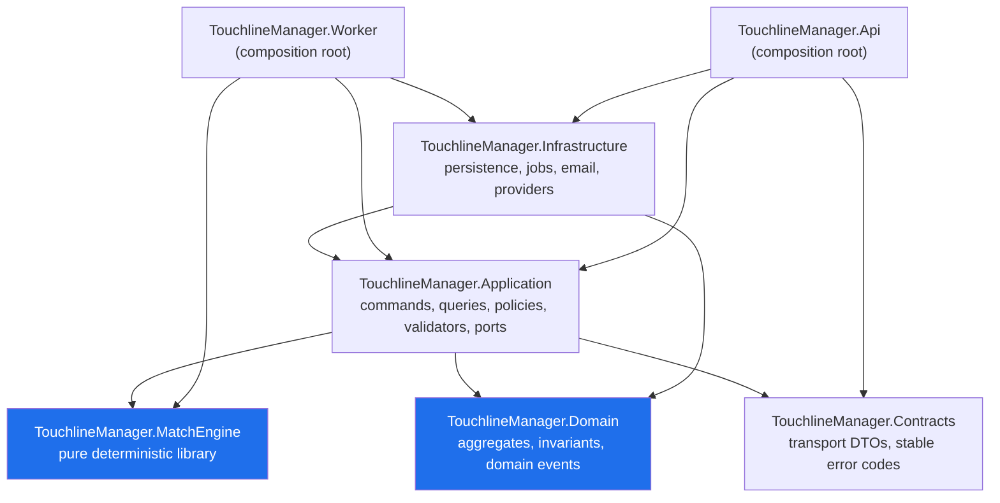

# Bounded Modules

> Companion to [ADR-0001](../architecture/adr/0001-modular-monolith.md). Defines the module
> boundaries, what each module owns, how modules may talk to each other, and which
> implementation stage delivers each one.

---

## 1. Module map

| Module | PostgreSQL schema | Owns | Primary stages |
|---|---|---|---|
| **auth** | `auth` | Accounts, credentials, sessions, email tokens, roles, consents, lockout | 2, 13, 14 |
| **world** | `world` | World, countries, clubs, managers, tenures, division provisioning, generation runs | 3, 11 |
| **squad** | `squad` | Players, attributes, state, contracts, registrations, unavailability, tactical plans and slots, team sheets, training | 4, 8 |
| **competition** | `competition` | Seasons, divisions, division-seasons, club season entries, matchdays, fixtures, standings, player/club season stats, discipline | 6, 8, 12 |
| **match** | `match` | Input snapshots, matches, lineups, events, highlights, simulation attempts | 5, 6, 7 |
| **market** | `market` | Shortlists, transfer listings, bids, outcomes, AI market decisions | 10 |
| **finance** | `finance` | Club accounts, append-only ledger, season finance summaries | 9 |
| **comms** | `comms` | Inbox messages, news items, email dispatch intent | 6, 8, 11 |
| **ops** | `ops` | Jobs, outbox, idempotency records, audit log, feature flags, repair actions | 1, 6, 14 |

Logical model detail is in [`data-model.md`](data-model.md) and master plan §6.

---

## 2. Project dependency direction

Enforced by architecture tests (`tests/TouchlineManager.ArchitectureTests`). A violation fails
the build.

### Rules

| Rule | Statement |
|---|---|
| DEP-1 | `Domain` depends on **nothing** — no Application, Infrastructure, ASP.NET, EF Core, or UI package. |
| DEP-2 | `MatchEngine` is pure. It may depend on domain-neutral contracts only. It may not depend on EF Core, `IClock`, network, filesystem, culture, or framework randomness. |
| DEP-3 | `Application` depends on Domain, MatchEngine abstractions, and Contracts. It contains commands, queries, policies, validators, and ports. |
| DEP-4 | `Infrastructure` implements persistence, jobs, email, auth storage, and external providers. |
| DEP-5 | `Api` and `Worker` are composition roots and contain **no game formulas**. |
| DEP-6 | `Contracts` contains versioned transport DTOs and stable error codes, never entities. |
| DEP-7 | `MatchEngine` never depends on `Infrastructure` or `Api`/`Worker`, and neither composition root may reimplement engine logic. |
| DEP-8 | No project may reference `apps/*` from `src/*`. |

---

## 3. Module interaction rules

| Rule | Statement |
|---|---|
| MOD-1 | A module's tables are written only by that module's code. |
| MOD-2 | Cross-module writes happen through an application use case, never through a controller or job handler reaching into another module's repository. |
| MOD-3 | Cross-module reads may use a narrow read port or a projection query; they may not mutate. |
| MOD-4 | Cross-module side effects that must be atomic with the primary write use the outbox, written in the same transaction. |
| MOD-5 | A module's public surface is its application-layer commands, queries, and DTOs — never its entities or `DbContext`. |
| MOD-6 | Circular module dependencies are forbidden. Where a cycle seems necessary, the correct answer is a domain event via the outbox. |

### Declared interactions

| From → To | Kind | Example |
|---|---|---|
| world → auth | read | Verify the account is verified/active/suspended before a claim |
| world → competition | read/write via use case | Provisioning creates division-season entries and fixtures |
| world → finance | write via use case | Takeover ensures a club account exists; provisioning funds a new club |
| squad → world | read | Player registration and contracts reference a club |
| competition → squad | write via use case | Publication applies cards, injuries, fatigue, morale |
| competition → finance | write via use case | Publication posts gate revenue; rollover settles awards |
| match → squad | read at lock time | Freeze lineups, attributes, and state into a snapshot |
| match → competition | write via use case | Publication marks fixtures published and updates standings |
| market → squad | write via use case | Resolution moves registration and rewrites contracts |
| market → finance | write via use case | Reservations, payment, seller credit |
| comms ← all | consumed events | Inbox/news from publication, transfers, discipline, deadlines |
| ops ← all | infrastructure | Jobs, outbox dispatch, idempotency, audit |

---

## 4. Where each kind of code lives

| Concern | Location | Never in |
|---|---|---|
| Game formula (ratings, money amounts, tie-breaks) | Domain or MatchEngine, driven by the versioned rule set | Endpoints, job handlers, SQL |
| Deadline decision | `ops.jobs` row + application use case | In-memory timers, cron expressions in code |
| Authorization of a manager command | Application policy + endpoint filter | Controller body checks, client |
| HTTP shape, status codes, Problem Details | Api project | Domain |
| SQL, indexes, migrations | Infrastructure | Api, Domain |
| Presentation, interpolation, canvas drawing | Angular renderer (framework-neutral TS) | Server |
| Operator repair | Explicit audited repair use case + `ops.repair_actions` | Ad-hoc SQL, hidden admin bypasses |

---

## 5. Module readiness by stage

| Stage | Modules touched | Exit artifact |
|---|---|---|
| 0 | — | This document set |
| 1 | ops | Walking skeleton: one no-op durable job end to end |
| 2 | auth | Full authentication lifecycle |
| 3 | world, auth, competition (shell), finance (accounts) | Six countries, 108 clubs, atomic takeover |
| 4 | squad | Legal 22-player squads, tactics, training, contracts |
| 5 | match (engine only, no database) | Pure engine + benchmark lab |
| 6 | competition, match, ops, comms | First server-authoritative playable slice |
| 7 | match (presentation), web viewer | Commentary + 2D highlights |
| 8 | competition, squad, comms | Discipline, injuries, AI match management |
| 9 | finance, squad | Ledger, wages, renewals, awards |
| 10 | market, finance, squad | Timed auctions, AI market |
| 11 | world, comms, competition | Pyramid growth, inbox, inactivity |
| 12 | competition, finance, squad, world | Rollover and continuity |
| 13 | web (all features) | Feature-complete PWA |
| 14 | ops, security | Hardened live operations |
| 15–16 | — | Closed beta, public MVP |
